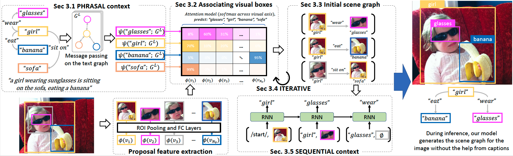

README.md shall be finished soon.

# WSSGG

* [0 Overview](#0-overview)
* [1 Installation](#1-installation)
    - [1.1 Faster-RCNN](#11-faster-rcnn)
    - [1.2 Language Parser](#12-language-parser)
    - [1.3 GloVe Embeddings](#13-glove-embeddings)
* [2 Settings](#2-settings)
    - [2.1 VG-GT-Graph and VG-Cap-Graph](#21-vg-gt-graph-and-vg-cap-graph)
    - [2.2 COCO-Cap-Graph](#22-coco-cap-graph)
* [3 Training and Evaluation](#3-training-and-evaluation)
    - [3.1 Multi-GPUs training](#31-multi-gpus-training)
    - [3.2 Single-GPU training](#32-single-gpu-training)
    - [3.3 Performance on test set](#33-performance-on-test-set)
    - [3.4 Primary configs and implementations](#34-primary-configs-and-implementations)
* [4 Visualization](#4-visualization)
* [5 Reference](#5-reference)

## 0 Overview

Our model uses the image's paired caption as weak supervision to learn the entities in the image and the relations among them.
At inference time, it generates scene graphs without help from texts.
To learn our model, we first allow context information to propagate on the text graph to enrich the entity word embeddings (Sec. 3.1). 
We found this enrichment provides better localization of the visual objects.
Then, we optimize a text-query-guided attention model (Sec. 3.2) to provide the image-level entity prediction and associate the text entities with visual regions best describing them.
We use the joint probability to choose boxes associated with both subject and object (Sec. 3.3), then use the top scoring boxes to learn better grounding (Sec. 3.4).
Finally, we use an RNN (Sec. 3.5) to capture the vision-language common-sense and refine our predictions.



## 1 Installation

```
git clone "https://github.com/yekeren/WSSGG.git" && cd "WSSGG"
```

We use Tensorflow 1.5 and Python 3.6.4. To continue, please ensure that at least the correct Python version is installed.
[requirements.txt](requirements.txt) defines the list of python packages we installed.
Simply run ```pip install -r requirements.txt``` to install these packages after setting up python.
Next, run ```protoc protos/*.proto --python_out=.``` to compile the required protobuf protocol files, which are used for storing configurations.

```
pip install -r requirements.txt
protoc protos/*.proto --python_out=.
```

### 1.1 Faster-RCNN
Our Faster-RCNN implementation relies on the [Tensorflow object detection API](https://github.com/tensorflow/models/tree/master/research/object_detection).
Users can use ```git clone "https://github.com/tensorflow/models.git" "tensorflow_models" && ln -s "tensorflow_models/research/object_detection" ``` to set up.
Also, don't forget to using ```protoc``` to compire the protos used by the detection API.

The specific Faster-RCNN model we use is [faster_rcnn_inception_resnet_v2_atrous_lowproposals_oidv2](http://download.tensorflow.org/models/object_detection/faster_rcnn_inception_resnet_v2_atrous_lowproposals_oid_2018_01_28.tar.gz) to keep it the same as the [VSPNet](https://github.com/alirezazareian/vspnet). More information is in [Tensorflow object detection zoo](https://github.com/tensorflow/models/blob/master/research/object_detection/g3doc/tf1_detection_zoo.md).

```
git clone "https://github.com/tensorflow/models.git" "tensorflow_models" 
ln -s "tensorflow_models/research/object_detection"
cd tensorflow_models/research/; protoc object_detection/protos/*.proto --python_out=.; cd -

mkdir -p "zoo"
wget -P "zoo" "http://download.tensorflow.org/models/object_detection/faster_rcnn_inception_resnet_v2_atrous_lowproposals_oid_2018_01_28.tar.gz"
tar xzvf zoo/faster_rcnn_inception_resnet_v2_atrous_lowproposals_oid_2018_01_28.tar.gz -C "zoo"
```

### 1.2 Language Parser
Though we indicate the dependency on spacy in [requirements.txt](requirements.txt), we still need to run ```python -m spacy download en``` for English.
Then, we checkout the tool at [SceneGraphParser](https://github.com/vacancy/SceneGraphParser) by running ```git clone "https://github.com/vacancy/SceneGraphParser.git" && ln -s "SceneGraphParser/sng_parser"```

```
python -m spacy download en
git clone "https://github.com/vacancy/SceneGraphParser.git"
ln -s "SceneGraphParser/sng_parser"
```

### 1.3 GloVe Embeddings
We use the pre-trained 300-D GloVe embeddings.

```
wget -P "zoo" "http://nlp.stanford.edu/data/glove.6B.zip"
unzip "zoo/glove.6B.zip" -d "zoo"

python "dataset-tools/export_glove_words_and_embeddings.py" \
  --glove_file "zoo/glove.6B.300d.txt" \
  --output_vocabulary_file "zoo/glove_word_tokens.txt" \
  --output_vocabulary_word_embedding_file "zoo/glove_word_vectors.npy"
```

## 2 Settings

**To avoid the time-consuming Faster RCNN processes** in [2.1](#21-vg-gt-graph-and-vg-cap-graph) and [2.2](#22-coco-cap-graph), users can directly download the features we provided at the following URLs.
Then, the scripts [create_vg_settings.sh](dataset-tools/create_vg_settings.sh#L77) and [create_coco_setting.sh](dataset-tools/create_coco_setting.sh#62) will check the existense of the Faster-RCNN features and skip the processs if they are provided.
Please note that in the following table, we assume the directory for holding the VG and COCO data to be ```vg-gt-cap``` and ```coco-cap```.

| Name                      | URLs                                                                                              | Please extract to directory |
|---------------------------|---------------------------------------------------------------------------------------------------|-----------------------------|
| VG Faster-RCNN features   | https://storage.googleapis.com/weakly-supervised-scene-graphs-generation/vg_frcnn_proposals.zip   | vg-gt-cap/frcnn_proposals/  |
| COCO Faster-RCNN features | https://storage.googleapis.com/weakly-supervised-scene-graphs-generation/coco_frcnn_proposals.zip | coco-cap/frcnn_proposals/   |

### 2.1 VG-GT-Graph and VG-Cap-Graph

Typing ```sh dataset-tools/create_vg_settings.sh "vg-gt-cap"``` will generate VG-related files under the folder "vg-gt-cap" (for both VG-GT-Graph and VG-Cap-Graph settings). 
Basically, it will download the datasets and launch the following programs under the [dataset-tools](dataset-tools) directory.

| Name                                                                               | Desc.                                                 |
|------------------------------------------------------------------------------------|-------------------------------------------------------|
| [create_vg_frcnn_proposals.py](dataset-tools/create_vg_frcnn_proposals.py)         | Extract VG visual proposals using Faster-RCNN         |
| [create_vg_text_graphs.py](dataset-tools/create_vg_text_graphs.py)                 | Extract VG text graphs using Language Parser          |
| [create_vg_vocabulary](dataset-tools/create_vg_vocabulary.py)                      | Gather the VG vocabulary                              |
| [create_vg_gt_graph_tf_record.py](dataset-tools/create_vg_gt_graph_tf_record.py)   | Generate TF record files for the VG-GT-Graph setting  |
| [create_vg_cap_graph_tf_record.py](dataset-tools/create_vg_cap_graph_tf_record.py) | Generate TF record files for the VG-Cap-Graph setting |


### 2.2 COCO-Cap-Graph

Typing ```sh dataset-tools/create_coco_settings.sh "coco-cap" "vg-gt-cap"``` will generate COCO-related files under the folder "coco-cap" (for COCO-Cap-Graph setting). 
Basically, it will download the datasets and launch the following programs under the [dataset-tools](dataset-tools) directory.
Please note that the "vg-gt-cap" directory should be created in that we need to get the split information (either Zareian et al. or Xu et al.).

| Name                                                                                   | Desc.                                                   |
|----------------------------------------------------------------------------------------|---------------------------------------------------------|
| [create_coco_frcnn_proposals.py](dataset-tools/create_coco_frcnn_proposals.py)         | Extract COCO visual proposals using Faster-RCNN         |
| [create_coco_text_graphs.py](dataset-tools/create_coco_text_graphs.py)                 | Extract COCO text graphs using Language Parser          |
| [create_coco_vocabulary](dataset-tools/create_coco_vocabulary.py)                      | Gather the COCO vocabulary                              |
| [create_coco_cap_graph_tf_record.py](dataset-tools/create_coco_cap_graph_tf_record.py) | Generate TF record files for the COCO-Cap-Graph setting |

## 3 Training and Evaluation

Multi-GPUs (5 GPUs in our case) training cost less than 2.5 hours to train a single model, while single-GPU strategy requires more than 8 hours.

### 3.1 Multi-GPUs training

We use [TF distributed training](https://www.tensorflow.org/guide/distributed_training) to train the models shown in our paper.
For example, the following command shall create and train a model specified by the proto config file [configs/GT-Graph-Zareian/base_phr_ite_seq.pbtxt](configs/GT-Graph-Zareian/base_phr_ite_seq.pbtxt), and save the trained model to a directory named "logs/base_phr_ite_seq".
In [train.sh](train.sh), we create 1 ps, 1, chief, 3 workers, and 1 evaluator.
The 6 instances are distributed on 5 GPUS (4 for training and 1 for evaluation).

```
sh train.sh \
  "configs/GT-Graph-Zareian/base_phr_ite_seq.pbtxt" \
  "logs/base_phr_ite_seq"
```

### 3.2 Single-GPU training

Our model can also be trained using single GPU strategy such as follow.
However, we would suggest to half the learning rate or explore for better other hyper-parameters.

```
python "modeling/trainer_main.py" \
  --pipeline_proto "configs/GT-Graph-Zareian/base_phr_ite_seq.pbtxt" \
  --model_dir ""logs/base_phr_ite_seq""
```

### 3.3 Performance on test set

During the training process, there is an evaluator measuring the model's performance on the validation set and save the best model checkpoint.
Finally, we use the following command to evaluate the saved model's performance on the test set.
This evaluation process will last for 2-3 hours depends on the post-process parameters (e.g., see [here](configs/GT-Graph-Zareian/base_phr_ite_seq.pbtxt#L69)).
Currently, there are many kinds of stuff written in pure python, which we would later optimize to utilize GPU better to reduce the final evaluation time.

```
python "modeling/trainer_main.py" \
  --pipeline_proto "configs/GT-Graph-Zareian/base_phr_ite_seq.pbtxt" \
  --model_dir ""logs/base_phr_ite_seq"" \
  --job test
```

### 3.4 Primary configs and implementations

Take [configs/GT-Graph-Zareian/base_phr_ite_seq.pbtxt](configs/GT-Graph-Zareian/base_phr_ite_seq.pbtxt) as an example, the following configs control the model's behavior.

| Name                 | Desc.                                                                          | Impl.                                                          |
|----------------------|--------------------------------------------------------------------------------|----------------------------------------------------------------|
| linguistic_options   | Specify the phrasal context modeling, remove the section to disable it.        | [models/cap2sg_linguistic.py](models/cap2sg_linguistic.py)     |
| grounding_options    | Specify the grounding options.                                                 | [models/cap2sg_grounding.py](models/cap2sg_grounding.py)       |
| detection_options    | Specify the WSOD model, ```num_iterations``` to control the iterative process. | [models/cap2sg_detection.py](models/cap2sg_detection.py)       |
| relation_options     | Specify the relation detection modeling.                                       | [models/cap2sg_relation.py](models/cap2sg_relation.py)         |
| common_sense_options | Specify the sequential context modeling, remove the section to disable it.     | [models/cap2sg_common_sense.py](models/cap2sg_common_sense.py) |


## 4 Visualization

Please see [cap2sg.ipynb](cap2sg.ipynb).

## 5 Reference

If you find this project helps, please cite our CVPR2021 paper :)

```
@InProceedings{Ye_2021_CVPR,
  author = {Ye, Keren and Kovashka, Adriana},
  title = {Linguistic Structures as Weak Supervision for Visual Scene Graph Generation},
  booktitle = {Proceedings of the IEEE/CVF Conference on Computer Vision and Pattern Recognition (CVPR)},
  month = {June},
  year = {2021}
}
```

Also, please take a look at our old work in ICCV2019.

```
@InProceedings{Ye_2019_ICCV,
  author = {Ye, Keren and Zhang, Mingda and Kovashka, Adriana and Li, Wei and Qin, Danfeng and Berent, Jesse},
  title = {Cap2Det: Learning to Amplify Weak Caption Supervision for Object Detection},
  booktitle = {Proceedings of the IEEE/CVF International Conference on Computer Vision (ICCV)},
  month = {October},
  year = {2019}
}
```
